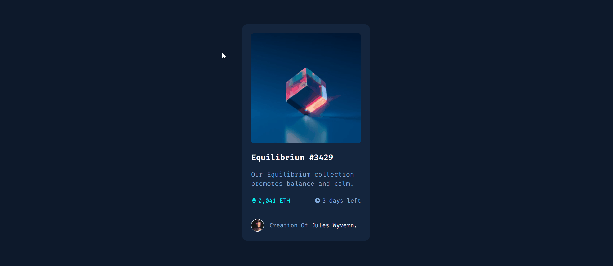

# Frontend Mentor  - Solução de componente de cartão de visualização NFT

Esta é uma solução para o [desafio do componente de cartão de visualização NFT no Frontend Mentor](https://www.frontendmentor.io/challenges/nft-preview-card-component-SbdUL_w0U). 

##  Indice

- [Visão geral](#visão-geral)
    - [O desafio](#o-desafio)
    - [Captura de tela](#captura-de-tela)
    - [Links](#links)
- [Meu processo](#meu-processo)
    - [Construído com](#construído-com)
    - [O que eu aprendi](#o-que-eu-aprendi)
    - [Desenvolvimento contínuo](#desenvolvimento-contínuo)
    - [Recursos úteis](#recursos-úteis)
- [Autor](#autor)
- [Gradecimentos](#agradecimentos)
---

## Visão Geral

### O desafio

Os usuários devem ser capazes de:

- Ver o layout ideal dependente do tamanho da tela do dispositivo;
- Ver os estados de interação dos elementos.
---
### Captura de tela

---


---

### Links

- [Solução do desafio](https://www.frontendmentor.io/solutions/foi-utilizado-a-tecnologia-flexbox-para-soluo-deste-desafio-H1BzNDW89)
- [Site ao vivo](https://wadson-ferreira.github.io/nft-card/)
---

## Meu processo

### Construído com


- Propriedades personalizadas de CSS
- Variáveis no CSS para manuseio das cores
- Flexbox
- Responsivo para dispositivos móveis

---
### O que eu aprendi

- Melhor Entendimento do uso do FlexBox;
  ```css
  main{
    display: flex;
    justify-content: center;
    align-items: center;
    height: 100vh;
    padding: 0 25px;}

- Uso na prática e entendimento das variáveis do CSS;

  ```css
  .nft-card .info .days-left{
    color: var(--primary-soft);}

- Aplicação de pseudo-classes para estilização;
  ```css
  .nft-card .info .price::before,
  .nft-card .info .days-left::before{
    content: '';
    width: 15px;
    height: 20px;
    display: inline-block;
    margin-right: 5px;}

- Uso do background na adição de imagens;

  ```css
  .nft-card .info .days-left::before{
    background: url(../images/icon-clock.svg) no-repeat center;}
---

## Desenvolvimento contínuo
- FlexBox;

melhorar o entendimento sobre a tecnologia e consiguir aplica-la em outros tipos de projetos.

- Variáveis;

Utilizar mais vezes para facilitar o entendimento sobre a mesma.

- Pseudo-classes;

Buscar conhecer mais psudo-classes para fazer um código mais limpo e que facilite ainda mais a manutenção.

---


## Recursos úteis

 * [FlexBox](https://developer.mozilla.org/pt-BR/docs/Learn/CSS/CSS_layout/Flexbox) - Utilizei o flexbox para montar um layout de maneira mais simples e responsiva. 
* [Variáveis CSS](https://developer.mozilla.org/pt-BR/docs/Web/CSS/Using_CSS_custom_properties)  - Fiz o uso de variáveis no CSS para aplicação das cores no projeto, o que facilitou na identação do código.
---

## Autor
- [Linkedin](https://www.linkedin.com/in/wadson-ferreira/) 

- [Instagram](https://www.instagram.com/dev.wadson/)

- [Github](https://github.com/Wadson-Ferreira)

---

## Agradecimentos


Agradeço ao WorkShop feito pela equipe do [Dev em Dobro](https://www.instagram.com/devemdobro/). Nele pude aprender formas de iniciar um projeto sem travar, além de um bom uso do flexbox e das variáveis do CSS.

